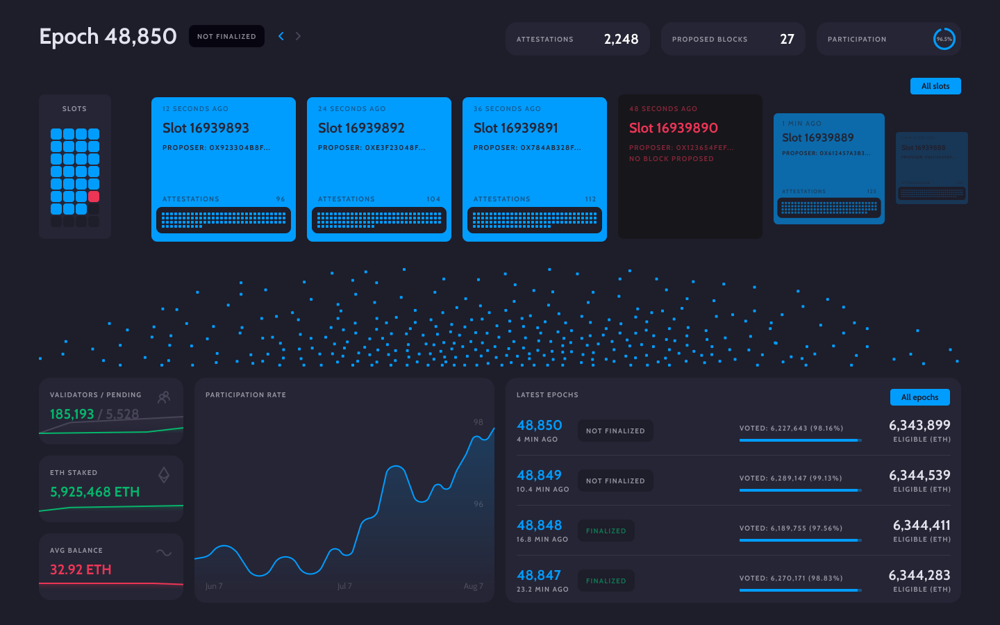

# Pool Viewer for Ethereum 2.0
Similar to a block explorer, but focused only on recent data. The exact definition of *recent* remains subject to final decision. Nonetheless, we propose to define the time span of *recent* to be **4 entire epochs** (= 25.6 minutes; see [Section 1](#1-ethereum-20-background---beacon-chain) for further background information).

## 1. Ethereum 2.0 Background - Beacon Chain
> Most of the information in this section is based on inputs from one of the best (non-too-technical) articles on Ethereum 2.0: [The Beacon Chain Ethereum 2.0 explainer you need to read first](https://ethos.dev/beacon-chain). We strongly recommend anyone who wants to dive deeper to read the article carefully.

The beacon chain provides the heartbeat to Ethereum 2.0. It provides the tempo and rhythm for the system's harmony and consensus. Each **slot** is *12 seconds* and an **epoch** is 32 slots (*6.4 minutes*). Think of a slot as a chance for a block to be added to the beacon chain and shards. You can imagine that the beacon chain and shard chains are choreographed in lockstep. Every 12 seconds, one beacon (chain) block and 64 shard blocks are added when the system is running optimally. Thus, each beacon block can contain up to 64 crosslinks (a crosslink is a reference in a beacon block to a shard block). Also, a slot is like the block time, but slots can be empty. Eventually, an epoch is a bundle of up to 32 slots (blocks) and is only considered finalised after the progression of two more epochs after it (i.e. *12.8 minutes*).

While proof-of-work (PoW) is associated with miners, in Ethereum 2.0 validators are proof-of-stake (PoS) **virtual miners**. **Validators** are actively participating in the consensus of the Ethereum 2.0 protocol. Validators are virtual and are activated by stakers. Each validator has a maximum balance of *32 ETH*, but stakers can stake all their ETH. For every 32 ETH staked, one validator is activated.

A block **proposer** is a validator that has been pseudorandomly selected to build a block. Furthermore, most of the time, validators are **attesters** that vote on beacon blocks and shard blocks. These votes are recorded in the beacon chain. The votes determine the head of the beacon chain and the heads of shards.

A **committee** is a group of validators. For security, each slot (in the beacon chain and each shard) has committees of *at least* 128 validators. At every epoch, validators are evenly divided across slots and then subdivided into committees of appropriate size. All of the validators from that slot attest to the beacon chain head. Each of the committees in that slot attempts to crosslink a particular shard. A shuffling algorithm scales up or down the number of committees per slot to get at least 128 validators per committee.

With this basic information, we can now proceed to evaluate what data can be included in the **Pool Viewer**. *Caveat:* Sharding is not yet live and therefore out of scope in the current setup (see [Future Work](#6-future-work)).

## 2. Recent Data
> *Important caveat:* Staking ETH permits the staker to act as a validator on Ethereum's PoS beacon chain, to support the Ethereum 2.0 upgrade, and to be eligible to earn staking rewards. The staked ETH (sETH2) **cannot** be un-staked and neither sETH2 nor any reward ETH2 may be transferred on the Ethereum network at this time. Thus, any transaction information, as we know it from e.g. Etherscan, will be subject to the implementation of Phase 1.0/1.5/2.0.
> - **Phase 1.0 (*the Merge*):** The current Ethereum mainnet will *merge* with the beacon chain PoS system. Originally it was planned that this would take place after the shard chains rollout, however the planning has been revised and it will precede the shard chains rollout. Expected end of 2021/early 2022. 
> - **Phase 1.5:** The legacy Ethereum chain becomes a shard on the new Ethereum blockchain. The shard chains spread the network's load across 64 new chains. Expected 2022+.
> - **Phase 2:** The shard chains will be fully functioning and able to communicate with each other and run smart contracts. Expected 2022+. 
> 
> The [`BeaconBlockBody`](https://github.com/ethereum/eth2.0-specs/blob/dev/specs/phase0/beacon-chain.md#beaconblockbody) currently consists of the following information that needs to be validated:
> ```python
> class BeaconBlockBody(Container):
>    randao_reveal: BLSSignature
>    eth1_data: Eth1Data  # Eth1 data vote
>    graffiti: Bytes32  # Arbitrary data
>    # Operations
>    proposer_slashings: List[ProposerSlashing, MAX_PROPOSER_SLASHINGS]
>    attester_slashings: List[AttesterSlashing, MAX_ATTESTER_SLASHINGS]
>    attestations: List[Attestation, MAX_ATTESTATIONS]
>    deposits: List[Deposit, MAX_DEPOSITS]
>    voluntary_exits: List[SignedVoluntaryExit, MAX_VOLUNTARY_EXITS]
>```
Recent data entail:
- **General:**
  - Total number of validators
  - Total number of pending validators
  - Total amount of ETH staked & benchmark to current overall ETH supply
  - Average account balance
  - Current slot
  - The most recent epoch
  - The most recent finalised epoch
- **At Epoch Level:**
  - Epoch number
  - Total number of attestations
  - Total number of proposed blocks
  - Percentage of validator participation in the given epoch
  - Finality of epoch
  - Age of epoch
  - Total amount of eligible voting ETH
  - Total amount of used eligible voting ETH
  - Total amount of new validator deposits
  - Proposer slashing event(s)
  - Attester slashing event(s)
  - Validator exit(s)
- **At Slot Level:**
  - Slot number
  - Epoch number
  - Status
  - Graffiti message (fun message)
  - Attestations 
  - Proposer
  - Details on block votes (slot number, committee index, validator addresses)
  - Details on attestations in slot (slot number, committee index & indices)
  - All cryptographic information (e.g. state root, RANDAO reveal etc.)
- **At Shard Level:**
  - Out of scope (see [Future Work](#6-future-work))
  
**Important:** The overall aim of this project is to reduce complexity and increase insights by visualisations. Therefore, the focus is heavily on the dimensions which provide insights and can be visualised rather than the cryptographic information (that can be retrieved by e.g. [BeaconScan](https://beaconscan.com) or [beaconcha.in](https://beaconcha.in)).

## 3. Ethereum 2.0 APIs
As summarised on the wishlist of the [Ecosystem Support Program](https://esp.ethereum.foundation/en/wishlist), there are multiple ways to connect with the Ethereum 2.0 blockchain:
- **Ethereum 2.0 Networking REPL:** REPL is a *Read-Eval-Print Loop* (REPL), a programming environment that enables you to interact with Ethereum 2.0 components by evaluating one code expression at a time. The go-to-source for this approach is [Rumor](https://github.com/protolambda/rumor), an interactive shell written in Golang.
- **Gossipsub Protocol:** Gossipsub is an extensible baseline pubsub (publish–subscribe) protocol, based on randomised topic meshes and gossip. There are multiple implementations available ([source](https://github.com/libp2p/specs/tree/master/pubsub/gossipsub)):

    Legend: ✅ = complete, 🏗 = in progress, ❕ = not started yet

    | Name                                                                                             | v1.0  | v1.1  |
    |--------------------------------------------------------------------------------------------------|:-----:|:-----:|
    | [go-libp2p-pubsub (Golang)](https://github.com/libp2p/go-libp2p-pubsub/blob/master/gossipsub.go) |   ✅  |   ✅  |
    | [js-libp2p-gossipsub (JavaScript)](https://github.com/ChainSafe/js-libp2p-gossipsub)                    |   ✅  |   ✅  |
    | [rust-libp2p (Rust)](https://github.com/libp2p/rust-libp2p/tree/master/protocols/gossipsub)      |   ✅ |   🏗  |
    | [py-libp2p (Python)](https://github.com/libp2p/py-libp2p/tree/master/libp2p/pubsub)              |   ✅  |   🏗  |
    | [jvm-libp2p (Java/Kotlin)](https://github.com/libp2p/jvm-libp2p/tree/develop/src/main/kotlin/io/libp2p/pubsub) |   ✅  |   🏗  |
    | [nim-libp2p (Nim)](https://github.com/status-im/nim-libp2p/blob/master/libp2p/protocols/pubsub/gossipsub.nim) |   ✅  |   🏗  |

- **Ethereum 2.0 Beacon Node API:** The beacon node API allows for interactions between beacon nodes, including p2p networking connectivity as well as getting current beacon chain state and blocks from other nodes. There are multiple node implementations that can be used (see also [here](https://ethereum.org/en/eth2/get-involved/#clients)):
  > *Difference between beacon nodes and validator clients:* Beacon nodes are connected via p2p to other beacon nodes while validator clients maintain a dedicated connection with a single beacon node. The validator client is more or less equivalent to the miner on the Ethereum 1.0 blockchain.
  - [Nimbus](https://github.com/status-im/nimbus-eth2) - Nim Ethereum 2.0 node implementation
  - [Teku](https://github.com/ConsenSys/teku) - Java Ethereum 2.0 node implementation
  - [Lighthouse](https://github.com/sigp/lighthouse) - Rust Ethereum 2.0 node implementation
  - [Prysm](https://github.com/prysmaticlabs/prysm) - Golang Ethereum 2.0 node implementation
  - [Cortex](https://github.com/NethermindEth/cortex) - C# (.NET) Ethereum 2.0 node implementation
  - [Lodestar](https://github.com/ChainSafe/lodestar) - TypeScript Ethereum 2.0 node implementation
  - [Trinity](https://github.com/ethereum/trinity) - Python Ethereum 2.0 node implementation
  > There is an effort to standardise an Ethereum 2.0 API for all node implementations [here](https://github.com/ethereum/eth2.0-apis), and all the above nodes are currently working on implementing it into their codebase. However, for the meantime, they use client-specific APIs. E.g. in the [Prysm](https://docs.prylabs.network/docs/how-prysm-works/prysm-public-api) beacon node, [`ethereumapis`](https://github.com/prysmaticlabs/ethereumapis) is the currently supported client-specific API schema.
- **Third-Party API Providers:** Another option would be to retrieve all the necessary data via third-party API providers such as [Infura](https://infura.io) or [Alechemy](https://www.alchemy.com). Infura already provides an API service via a [Teku node implementation](https://infura.io/docs/eth2).

### 3.1 Proposed Path
The focus of this project is the **user-friendly visualisation** of recent Ethereum 2.0 data and not the technical backbone of Ethereum 2.0 itself. Therefore, we will avoid using a networking REPL or Gossipsub protocol directly. To ensure a sustainable implementation with minimal technical debt and at the same time preserve the open-source notion, it is preferable that we wait until a **standardised** Ethereum 2.0 API is built into the node implementations. This will allow developers to clone the repository and link their own node implementation without any complex reconfigurations in the future. From a risk management point of view, in the long run we should have a combination of different node implementations (2-3 different implementations) & third-party APIs to avoid wrong visualisations (which could be caused by a faulty implementation). However, if standardisation of the API takes too long, we would suggest starting with the [Prysm](https://github.com/prysmaticlabs/prysm) implementation.

## 4. Open Questions
- **Chain Reorganisations:** There is an ongoing discussion concerning chain reorganisations in the PoS system (see, e.g., [here](https://www.paradigm.xyz/2021/07/ethereum-reorgs-after-the-merge)). Simply put, a chain reorganisation (or just simply a *reorg*) is an event where a block that was part of the *canonical chain* becomes no longer part of the canonical chain because a competing block beat it out. The canonical chain is determined by the *fork choice rule*: It is a function evaluated by the client that takes as input the set of blocks and other messages that have been seen and outputs to the client what the canonical chain is. Even though we expect fewer chain reorgs in the PoS system, and they should be prevented by slashing events, they are still feasible (and slashing events do not yet exist for certain strategies; see, e.g., [here](https://arxiv.org/pdf/2102.02247.pdf)). The open question is how we properly detect, evaluate, and depict chain reorgs?
- **Ethereum 2.0 API Standardisation:** As already mentioned above, there is an effort to standardise an Ethereum 2.0 API for all node implementations [here](https://github.com/ethereum/eth2.0-apis). However, what if this takes too long? What are the decision dimensions to consider? Focusing solely on *one* client implementation contradicts the ambition of a wide client diversity.
- **Data Latency:** What is the best architectural approach to technically implement the fastest API data retrieval to constantly ensure best-in-class ground truth data?

## 5. Example Mockup Pool Viewer
Based on our knowledge and our ideas we have already designed a mockup of the **Pool Viewer**:
<div align="center">
  
</div> 

## 6. Future Work
The current **Pool Viewer** is constrained by the speed of Ethereum's 2.0 development and the basic PoS beacon chain data. It is crucial that once *the Merge*, sharding, and account & smart contract functionality is implemented, all the necessary transaction and per-shard data needs to be included in the **Pool Viewer**. So one could (visually) zoom into the epoch, then into the slot, and finally into the shard level with all transaction & additional operational data.

## 7. License
The [`pool-viewer`](https://github.com/pcaversaccio/pool-viewer) implementation is licensed under the [GNU General Public License v3.0](https://www.gnu.org/licenses/gpl-3.0.en.html), also included in our repository in the [`LICENSE`](https://github.com/pcaversaccio/pool-viewer/blob/main/LICENSE) file.
